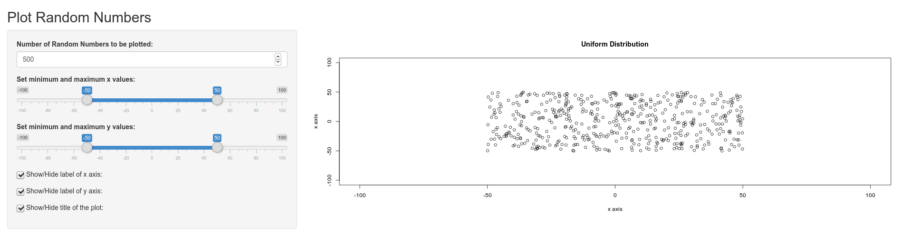
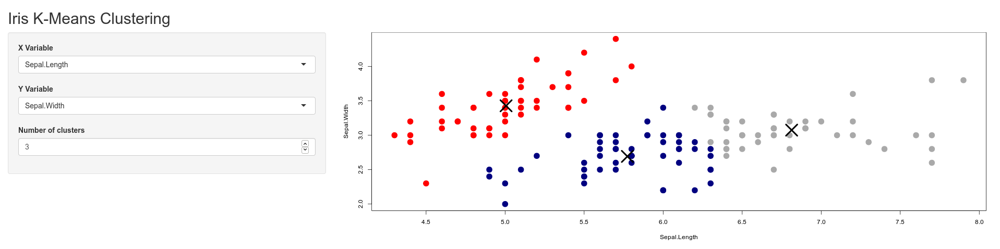
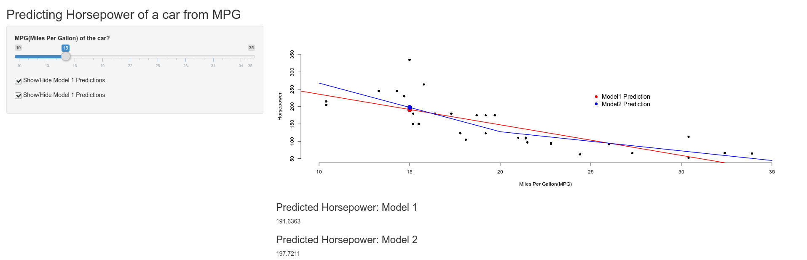

# Shiny101

This is a collection of Projects created with Shiny, a web application framework for R.
Shiny makes it easy to create interactive web applications with using R code only.
More details about Shiny can be found [here](https://shiny.rstudio.com).

### Prerequisites
- In order to run these projects in your local environment, you need to have R and RStudio installed. If they are not installed already, install R [here](https://cran.r-project.org/bin/windows/base/) and RStudio [here](https://rstudio.com/products/rstudio/download/).
- You need to have "Shiny" installed as an R package.
```{r}
install.packages('shiny')
```
- It is recommended that you load Shiny before trying to run any of these projects.
```{r}
library(shiny)
```
### How to run
- Clone this repository.
- Open this project(Shiny101.Rproj) with RStudio.
- If you have loaded shiny already, type runApp() command with the name of the directory which contains the project that you want to run. Ex: If you want to run the Plot Random Values, you can simply type the following command in RStudio.
```{R}
runApp('Norm')
```
- If you have not loaded Shiny:
```{R}
shiny::runApp('Norm')
```

# Projects
## [1. Plot Random Numbers](Norm)



This is a simple Shiny application to plot a normal distribution of random numbers.
The application is capable of dynamically changing its output(i.e. The plot) with the changes made to its parameters by the user via tweaking the controls.
6 controls are given to the user to adjust the plot.
1. Number of random numbers to be plotted. This should be a positive integer.
2. Minimum and maximum values for the x axis. The minimum value can be decreased upto -100 and the maximum value can be increased upto 100.
3. Minimum and maximum values for the y axis. The minimum value can be decreased upto -100 and the maximum value can be increased upto 100.
4. Toggle option to hide/show the label of x axis.
5. Toggle option to hide/show the label of y axis.
6. Toggle option to hide/show the label of the plot.

## [2. Iris K-Means Clustering](Iris_K_Means)



A Shiny application to plot clustering analysis done on the infamous Iris dataset.
The application is capable of dynamically perform K-Means clustering on the Iris dataset with changing user inputs.
There are four numerical variables in the dataset(Sepal.Length, Sepal.Width, Petal.Length, Petal.Width) that can be used with k-means clustering.
3 Controls are given to the user to adjust the clustering and the plot.
1. A variable for X axis
2. A variable for Y axis
3. Number of clusters(Minimum of 1 and maximum of 9)

## [3. Predicting Horsepower](Predicting_Horsepower)



A Shiny application to predict Horsepower of a car's engine using its gas efficiency(miles per gas).
The application takes a MPG value for a car and predicts its horsepower using it. 
Trained with the native R dataset, <mark>mtcars</mark>.
Two smodels are used for prediction. One uses only the mpg value input for prediction and the other uses a new variable(mpgsp) along with the entered mpg value. The new value is derived from the mpg. It has a breaking point at 20. <mark>mpgsp</mark> of a car that has smaller mpg than 20 will be set to 0 and a car with higher mpg than 20 will be replaced with the value of <mark> mpg of the car - 20</mark>.
As per the output, predictions from both models will be displayed and a plot will be rendered with the current data points from <mark>mtcars</mark>, each fitted models and predicted data points from both models.
3 controls are given to the user.
1. A value for mpg.
2. Option to include the fitted model for model1(Which uses only mpg).
3. Option to include the fitted model for model2(Which uses mpg and mpgsp).
